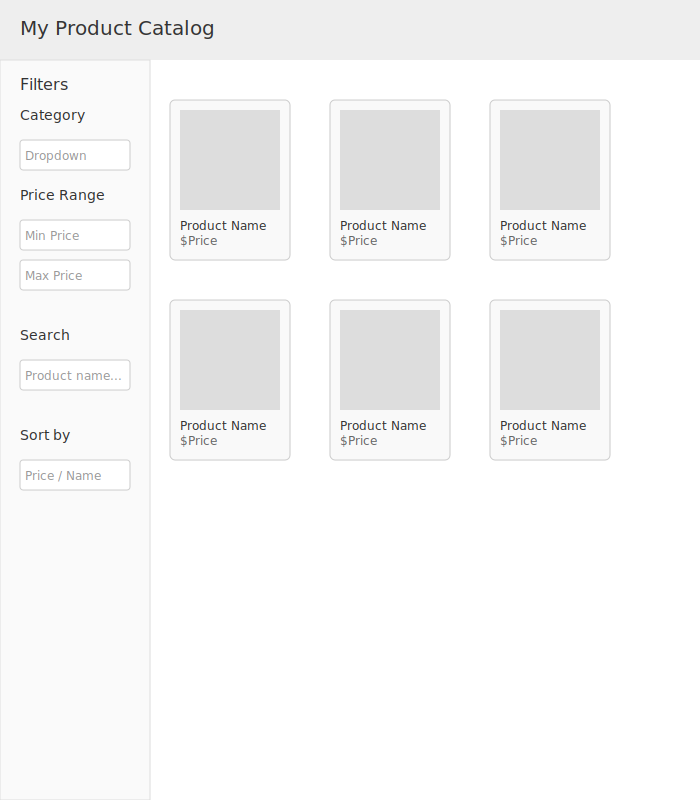

# Product Catalog: Front-End Take-Home Coding Challenge

## Overview

Build a simple product catalog using data from [Fake Store API](https://fakestoreapi.com/products). The user interface should allow:

1. Selecting a category to filter products.
2. Filtering products by a price range.
3. Searching products by title.
4. Combining multiple filters at the same time.

You are free to use plain HTML, CSS, and JavaScript—no frameworks are required. The focus is on your ability to structure your code, manage state, and implement filtering logic.

---

## Requirements

### Core Functionality

1. **Fetch and Display Products**
   - Fetch all products from: `GET https://fakestoreapi.com/products`
   - Display the products in a grid or list layout.

2. **Category Selection**
   - Extract unique categories from the product list (e.g., `electronics`, `jewelery`, `men's clothing`, `women's clothing`).
   - Provide a way for users to select a category and only show products in that category.

3. **Price Range Filter**
   - Allow users to set a minimum and maximum price.
   - Only show products whose prices fall within this range.

4. **Search by Title**
   - Provide a search input that filters products by title substring.

5. **Combined Filters**
   - All filters (category, price range, search) should work together.
   - For example, if a category and a price range are selected, show only products matching both criteria, and also apply search if the user enters a search term.

### Optional Enhancements

- **Sorting**: Allow users to sort filtered products by price or title.
- **Product Details**: Clicking on a product can show more detailed information (e.g., in a modal).

### Technical Details

- Use plain HTML, CSS, and JavaScript. No frameworks are required.
- Fetch data from the provided API.
- Structure your code logically (e.g., separate data fetching from rendering, etc.).
- Handle loading states and errors (e.g., show a message if the API request fails).

### Testing

- Include at least one test (it can be a very simple unit test in a separate file or a code snippet). Explain how to run it in the `README.md`.

### Documentation

- Include a `README.md` with:
  - Instructions on how to run your solution locally.
  - A brief explanation of your approach.
  
### Accessibility & UX

- Aim for accessible markup (e.g., semantic HTML, proper labels).
- Provide a responsive design that looks good on various screen sizes.
- Show a loading message while fetching products.
- If no products match filters, show a user-friendly message.

---

## Data Model

**Product Example:**

```json
{
  "id": 1,
  "title": "Fjallraven - Foldsack No. 1 Backpack, Fits 15 Laptops",
  "price": 109.95,
  "description": "Your perfect pack for everyday use and walks in the forest...",
  "category": "men's clothing",
  "image": "https://fakestoreapi.com/img/81fPKd-2AYL._AC_SL1500_.jpg",
  "rating": {
    "rate": 3.9,
    "count": 120
  }
}
```

---

## Wireframe


